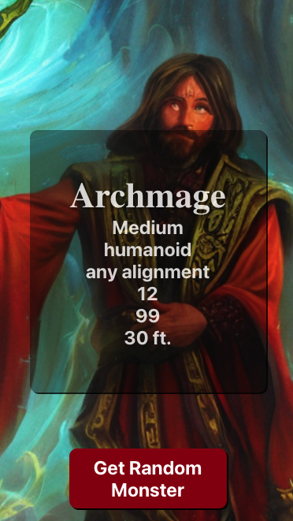

# D&D Generator App



## Description

The D&D Generator App is a simple mobile application built with React Native. Please note that this project is primarily designed as a learning exercise to explore React Native development and is not intended for serious use. It provides a fun way to randomly generate Dungeons & Dragons (D&D) monsters and view their details.

## Features

- Randomly generate D&D monsters.
- View monster details such as size, type, alignment, challenge rating, hit points, and speed.
- Learn and practice React Native development concepts.
- Explore API integration with the D&D 5e API.

## Getting Started

To get started with this project, follow these steps:

1. **Clone the Repository:**

   ```bash
   git clone https://github.com/stoyanov-kaloyan/dnd-generator-app.git
   cd dnd-generator-app
   ```

2. **Install Dependencies:**

   ```bash
   npm install
   # or
   yarn install
   ```

3. **Run the Application:**

   ```bash
   expo start
   ```

4. **View the App:**

   Use the Expo Go app on your mobile device or an emulator/simulator to view and interact with the D&D Generator App.

## Disclaimer

This project is solely for educational purposes and to learn React Native development. The app's data is sourced from the D&D 5e API (https://www.dnd5eapi.co/api/), and it may not provide complete or accurate information for serious D&D gameplay or reference.

## Contributing

Contributions to this project are welcome. Feel free to fork the repository, make improvements, and submit pull requests. If you encounter any issues or have suggestions, please open an issue on the GitHub repository.

## License

This project is open-source and available under the [MIT License](LICENSE).
